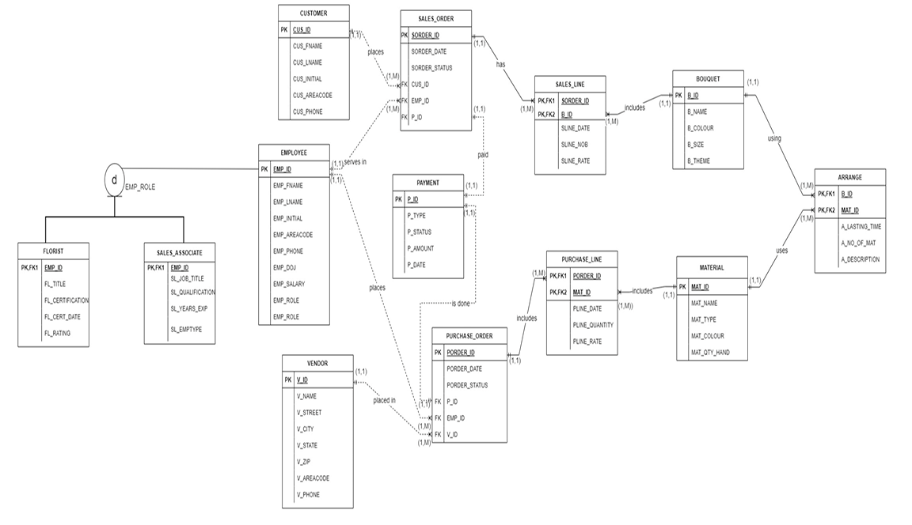

#### Flower Shop Database Management System

The Flower Shop Database Management System serves as a vital tool for retail flower shops, facilitating efficient management of customers, employees, orders, inventory, vendors, and transactions. With comprehensive data storage and tracking capabilities, the system enables administrators and employees to monitor shop activities effectively. It supports various functionalities such as recording customer orders, managing inventory levels, tracking vendor interactions, and analyzing sales data to enhance business operations. By leveraging the database, flower shops can optimize customer relationships, streamline inventory management, and strategize for business growth effectively.

#### Entity Relationship Diagram

